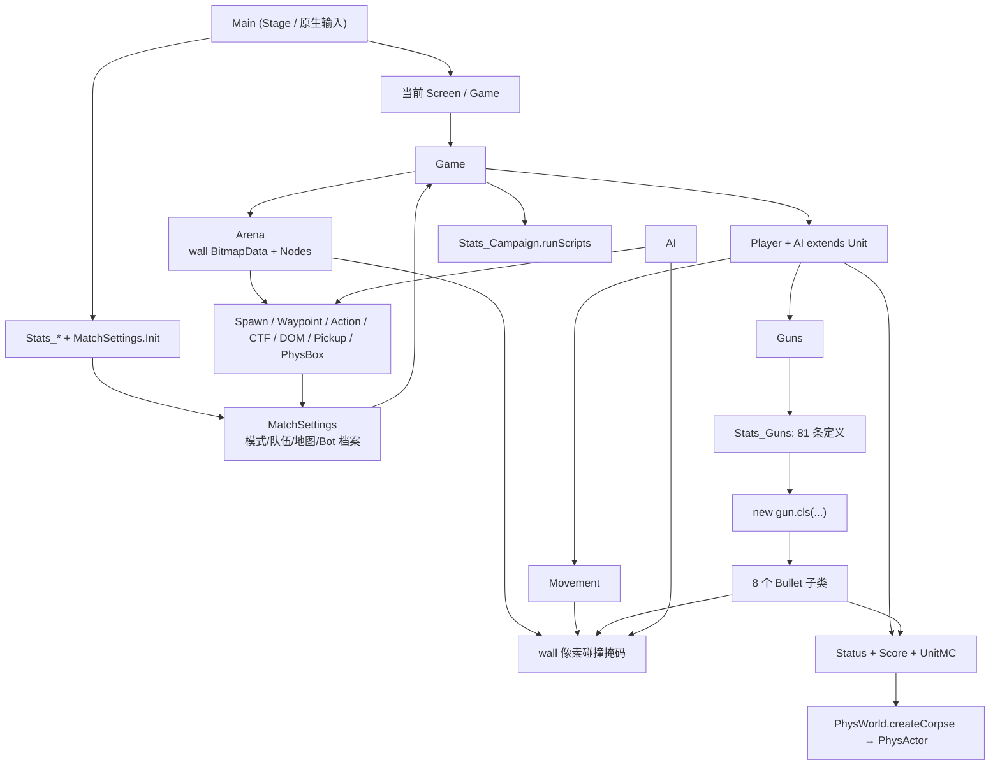

# 原 SWF 运行时关系总表（深度解包审计）

更新时间：2026-07-21。证据目录为 `assets/reverse/ffdec-deep-20260720/`，阅读对象为 FFDec 导出的 AS3；运行时证据与时间轴导出见 [SWF_DEEP_UNPACK_REPORT.md](SWF_DEEP_UNPACK_REPORT.md)。本文件的目标是让接手者能够从入口一路追到每个影响对局的对象，而不是把“解出图片”误认为“解出了游戏”。

## 1. “已全部解完”的准确边界

本次对 276 个 `.as` 文件做了静态索引，得到 **276 个类声明**。所有会改变对局状态、碰撞、伤害、AI 决策、目标分数、出生、战役脚本或武器行为的类，已逐类阅读并列入本表：`Main`、`Game`、`Arena`、`MatchSettings`、`Unit`/`Player`/`AI`、`Movement`、`Guns`、`Status`、`Score`、`PhysWorld`/`PhysActor`、8 个 Bullet 子类、8 个 Node、4 个全局连杀、`Radar`、`Water`、`BitScreen`、`Effect`、`Particle`、`Stats_*` 数据表和 `Stats_Campaign`。

可以据此说：**原版单机对局的所有核心运行时路径已经被定位、关系已建模、数据入口已清楚。**

不能诚实地说“每一个 SWF 像素和所有 276 个演示/SDK/UI 类的语义都已 1:1 重写”：纯菜单皮肤、广告/统计 SDK、音频混音和每个视觉粒子帧不改变规则，单列为资源/呈现层。它们已在索引中可查，却不应混进“战斗逻辑已验证”的结论。

可复跑的静态索引器在 `private-assets/parse-as3-relations.mjs`；它只读取文本，提取继承、字段类型、`new`、静态调用，不执行反编译代码。其测试会用真实 `Main`、`Game`、`Arena`、`Unit`、`Guns`、`Movement`、`Status`、`PhysWorld` 源码验证关键边。

## 2. 总关系图



### 帧序（30 FPS）

`Main.EnterFrame()` 先完成 `BH` 位图预处理，之后才调用当前对象与声音。对局内每帧固定是：

```text
Game.fc++ / 战役脚本 / 特殊地图震屏
→ Stats_MapParticles → Arena → PhysWorld.Step(1/30)
→ 清除 hitscan 线 → BitScreen → 全局连杀 → Hud
→ 每个 Unit（Status → Guns → UnitMC → Movement → 目标/节点）
→ pickup → bullets → effects / particles → MatchSettings → Radar → Water
```

`Unit` 会在移动之后重置/采样地图像素，写入下一帧使用的修正值。因此不能把“当前帧踩到哪种颜色”提前用于本次移动；那会形成一帧早到的错误。

## 3. 核心对象职责与直接关系

| 对象 | 直接创建/读取 | 产出或改变 |
| --- | --- | --- |
| `Main` | 初始化 `SD`、`SH`、各 `Stats_*`、`MatchSettings`；将鼠标/键盘/滚轮转发给 `curClass` | Screen 切换、声音时钟；不直接处理战斗 |
| `Game` | `Arena`、`PhysWorld`、`Player`、每个 `AI`、HUD、雷达、像素屏、地图粒子 | 主帧序、暂停、全局连杀、胜负；每帧调用战役脚本 |
| `Arena` | 当前地图 `wallMC`、所有 Node、`NodePhysBox` | `wall: BitmapData`、出生点、路线图、目标点、Box2D 静态物体 |
| `MatchSettings` | 选定的 `Stats_Maps` / `Stats_Misc` / Bot 档案 | 队伍数组、模式分数、胜负判定、随机武器档案 |
| `Unit` | `Movement`、`Guns`、`Status`、`Score`、`UnitMC` | 角色生命期、职业、出生、技能、连杀入口、显示部件 |
| `Player` | `Game.mouse`、左键状态 | 以 0.5 系数平滑瞄准，按住左键请求 `Guns.shoot()` |
| `AI` | 路点、动作框、墙体、敌人、枪械射程 | 目标选择、视线、寻路、模拟左右/跳/蹲/射击输入 |
| `Guns` | 当前 `Stats_Guns` 记录、手臂时间轴 | 换枪、装填、后坐、弹匣/备用弹、动态弹种构造 |
| `Status` | 命中对象、职业/技能/模式修正 | 护盾、HP、濒死技能、死亡、尸体和复活 |
| `PhysWorld` | `NodePhysBox` 和死亡 Unit | Box2D 静态墙体、15 部件尸体刚体、5 秒销毁 |

## 4. 地图、碰撞和节点

### 4.1 两套物理不可混用

```text
wallMC → Arena.draw() → BitmapData alpha == 0xFF
      → Movement / Bullet / AI line-of-sight / Radar / 地面颜色

NodePhysBox → Arena.physboxes → PhysWorld.generateWorld()
            → Box2D 静态刚体 → 仅尸体 PhysActor
```

活着的 Unit 从不在 Box2D 中走路。`Movement.hitTest()` 以整数像素探针读取 `wall`；脚底、头顶、左右躯干和攀爬探针用 0.5px 逐步修正。原网页应继续让一份 wall mask 同时服务移动、子弹和 AI，不能将可见贴图或蓝色 `NodePhysBox` 当作主碰撞。

### 4.2 Node 语义

| Node | 被谁消费 | 规则作用 |
| --- | --- | --- |
| `NodeSpawn` | `Unit.spawn()` | 队伍/CTF/首轮出生；绑定 waypoint |
| `NodeWaypoint` | `AI` | 名称下划线后字符是连接图；可带 ActionBox |
| `NodeAiAction` | `AI` | `j` 跳、`c` 蹲、`fp/fc/fd` 强制修正路径动作 |
| `NodePickup` | Unit | 定时刷新、碰撞后补给/效果 |
| `NodeHoldpoint` | DOM / `MatchSettings` | 旗帜上下移动并改变占领队；每 90 帧结算分数 |
| `NodeCtfFlag` | CTF / Unit | 敌旗拾取、持旗禁隐身/换枪，归还或送回己方旗帜得分 |
| `NodePhysBox` | `PhysWorld` | 给尸体的静态 Box2D fixture |
| `NodeWaypointPath` | AI | 路点搜索过程的父链/代价记录 |

### 4.3 地图表：14 个可选 ID

`Stats_Maps.getMap()` 的地图 ID 为 `tut`、`foundry`、`foundry2`、`train`、`train2`、`plane`、`plane2`、`swamp`、`swamp2`、`cave`、`cave2`、`dropship`、`missile`、`missile2`。夜晚/晨昏版可能复用同一 `map` 碰撞时间轴而替换背景、天空和粒子：Foundry/Foundry2 共用 `foundry`，Plane/Plane2 共用 `plane`，Swamp/Swamp2 共用 `swamp`，Cave/Cave2 共用 `cave`，Missile/Missile2 共用 `missile`。

`phys = sky` 的 plane/dropship/missile 地图会令尸体受风力；`phys = train` 有越界甩落；`extra = train/plane` 在 `Game` 中每 2 秒/0.5 秒震屏；swamp/cave 系列配置水色。它们改变的是地图特性，不是不同的活人碰撞算法。

## 5. 角色、输入与动画

`UnitMC`（Symbol 669）有 449 帧。`Unit` 持有它的头、躯干、两臂、双腿、脚和枪械；`UnitMC.EnterFrame()` 将 `head` 对齐 `headhold`，将两条手臂对齐 `arm1hold`；再由 `Unit` 覆盖瞄准、翻转和后坐。真实标签包含 idle、正/反跑、跳/落/硬落、蹲/蹲跑、滑铲、小/大攀爬。完整标签和逐帧 Matrix 见深度报告。

输入路径是：左键 `Main.MouseDown → Game.MouseDown → Player.mDown → Guns.shoot`；鼠标位置由 Game 转为 Arena 本地坐标；A/D 写移动方向，W 触发 `Movement.doJump()`，蹲伏与滚轮换枪通过同一事件转发。它不是“鼠标点一下创建一条射线”的独立 UI 行为。

## 6. 武器 → 子弹 → 伤害

`Stats_Guns.Init()` 有 **81** 条 `addGun` 数据；每条含职业表、解锁、伤害、force、splash、clip/备用倍率、range/recoil、自动/半自动、延迟、枪口/命中/弹壳/HUD、手臂 idle/fire/reload label、声音、`cls`、子弹参数与 extra。`Guns.makeBullet()` 的关键关系是：

```text
Stats_Guns.gunOb[id].cls  -- 动态工厂 --> new curGun.cls(game, owner, angle + spread, origin, xOff, id)
```

所以 `Guns` 到 Bullet 不是静态 `new Bullet` 边；它由 81 条表记录决定。已知弹种和语义：

| 类 | 命中/推进模型 |
| --- | --- |
| `Bullet_Line_Basic` | 构造期 10px 递进 hitscan，画线后移除 |
| `Bullet_Line_Sniper` | hitscan 后让线条淡出、轻微抖动 |
| `Bullet_Melee_Basic` | 立即近战扫描并移除 |
| `Bullet_Proj_Basic` | 帧推进的基础投射物 |
| `Bullet_Proj_Bounce` | 重力、墙体多点探测、反弹次数/时限爆炸 |
| `Bullet_Proj_Follow` | 重力、范围内锁敌、按旋转速度转向 |
| `Bullet_Proj_Mine` | 落地后仅对非蹲伏敌人触发，再爆炸 |
| `Bullet_Splash` | 以 splash 半径结算，命中后移除 |

所有子弹先看 `wall`，再看敌对活体，最后看尸体。站立命中框为宽 26、高 66（下 44 身体、上 22 头）；蹲伏高 44（下 28 身体）。`Status.damage()` 再按出生保护/反射、难度、人机关系、Jug、技能、队伤、暴击/爆头/溅射/盾、护盾、HP 的顺序处理；死亡才创建 `PhysActor`。

## 7. 技能、连杀、模式与随机性

`Stats_Skills` 的职业表是 Medic/Sniper/Commando/Tank；基础属性类技能在 `Unit.setClass()` 写入 HP/弹药/aim/crit/倍率，其余进入 `Status.damage()` 或 `Status.EnterFrame()`：低血 blur、蹲伏隐身、机枪 clip、抗爆/盾牌、下一击减伤、自救和死亡炸弹等。

`Score.addKill()` 增加 streak 并比较 `Stats_Streaks.kills`（charisma 使阈值减一）。非全局效果由 `Unit.useKillstreak()` 调用地雷、烟雾传送、surge、反射、燃烧、护甲、快速治疗；全局效果由 `Game.createKillstreak()` 创建雷达、毒气、直升机、空袭。持续效果不应立即清除 `streakInProgress`。

模式为 dm/jug/tdm/ctf/dom/zom；默认目标分数分别为 10/10/25/3/50/10。`MatchSettings` 负责分数聚合和胜负；CTF 和 DOM 额外消费节点。Quickmatch 的 Bot 在建局时按等级门槛抽一次职业、主/副武器、技能、连杀；正常复活不重掷。唯一全局改枪例外是 `party` mod，在 `Unit.setClass()` 覆盖为随机武器。

## 8. AI 与战役脚本

AI 每个 Bot 在 1–12 的错峰帧扫描目标，过滤死亡、同队、隐身、出生保护，射程为 `min(gun.range * 10, 450)`，并以 20px 步长查 `wall` 视线。无目标时按路线巡逻；有目标时按难度控制瞄准缓动和开火概率。它通过 NodeAction 写入与玩家相同的移动/跳跃/蹲伏/开火接口。

`Stats_Campaign.setMatch()` 是战役/挑战的数据工厂，`Game.EnterFrame()` 每帧调用 `runScripts()`。它包含：

- Campaign `caType=0`：15 个关卡，按 `fc`（30FPS 时间）、`sn` 阶段和队伍分数推进对话、延迟生成敌人、强制武器或永久状态；
- Challenge `caType=1`：15 个挑战；例如 10 秒重洗队伍、击杀得 Kevlar、仅火箭、永久直升机、Jug 排毒、吸血、特殊出生和团队出生；
- `addBot()` 若角色/枪/技能/连杀为空，才通过相应 `Stats_*` 表抽取；`noSpawn` 用于脚本化伏兵，`teamSpawn` 改出生逻辑，`forcePistol`、`permaSurge`、`permaRapid` 等由 `Unit`/`Guns`/`Status` 消费。

也就是说战役不是 Menu 里的静态关卡列表：它会在对局帧内改写 Unit 资料和生成时序，迁移时应当做成可序列化事件表或显式状态机。

## 9. 尸体、呈现和非规则层

死亡 Unit 会构成 15 个 Box2D 部件：躯干、头、两组上/下腿和脚、两组上/下臂和手，使用 Revolute joint；`bodypop` 或武器 `bodBreak` 可跳过 joint。尸体受武器 force、爆头冲量、天空/火车地图修正影响，5 秒销毁。它与活人移动彻底分离。

`BitScreen` 画地面痕迹，`Radar` 读取墙体/单位，`Water` 判断水区并产生波纹，`Effect` 和 `Particle` 管理视觉生命周期。它们可以最后移植，但不应在移植前拿掉其对 `wall`、Unit 状态或地图设置的读取关系。

## 10. 接手结论与仍需动态采样的边界

下一位实现者可以依据本文件完成“真实方案”的状态机和数据管线；不需要再从头猜原版架构。应按以下依赖顺序实施：wall mask → Movement/Bullet/AI 共用查询 → UnitMC 矩阵/label → Guns 的 81 条数据工厂 → Status/Score → Nodes/模式 → AI → Campaign。

仍需要在原 SWF 实机逐帧采样验证的项目只有呈现精度：每支枪的手臂子帧/声音触发点、每个粒子滤镜和混音、每张地图各时间轴帧实际同时活跃的节点、极端投射物碰撞的视觉位置。它们不再是“核心逻辑未知”，而是已有类和调用点上的视觉/边例校准任务。任何新结论应标记为「源码已证实」「时间轴已证实」或「实机采样已证实」，避免再次把推测写成原版事实。
